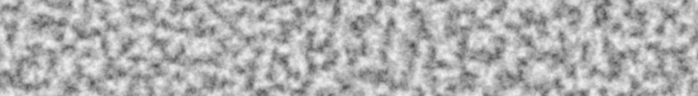

# noiz

A simple noise library built for and with [Bevy](https://bevyengine.org/).

Here's some fbm simplex noise as a taste:


## Quick Facts

Noiz is:
- Simple
- Extendable
- Blazingly fast (meant for realtime use)
- Easy to use in Bevy
- Built in pure rust
- Consistent between platforms (on paper)
- Serializable
- Reflectable
- Readable

Noiz is not:
- Spelled correctly (noise was already taken)
- Mathematically precise (only supports `f32` types for now)
- Fully optimized (algebraic float math is not stable in rust yet)
- Meant to replace art tools for asset generation
- Meant to be standalone (you'll want to also depend on either `bevy_math` or `bevy`.)

## Quick Start

Let's start with white noise.

```rust
// Create noise that, per cell, where each cell is on an orthogonal (cartesian) grid, creates a random unorm (between 0 and 1) `f32`.
let white_noise = Noise::<PerCell<OrthoGrid, Random<UNorm, f32>>>::default();
// Sample the noise in 2d to return an f32. We could also do 3d or 4d and ask for anything that implements `From` f32.
let some_value: f32 = white_noise.sample(Vec2::new(1.0, 2.3));
```

How does this work? Just a quick overview:

A `NoiseFunction` is a trait that takes an input, a random number generator, and produces an output.
It can produce different output types based on the input type.
`NoiseFunction`s can be chained together by putting them in tuples, ex: `(F1, F2)`.
In the example above, `PerCell` is a noise function.

`Noise` is a struct that holds a `NoiseFunction` as well as a `u32` seed and an `f32` frequency.
`Noise` implements `Sampleable`, allowing the inner `NoiseFunction` to be sampled,
`ConfigurableNoise`, allowing the seed and frequency to be set, and
`DynamicSampleable`, allowing dyn-safety and preventing inlining.

Lots of `NoiseFunction`s are available. Here's another example:

```rust
// Create noise that, mixes gradients from `QuickGradients` (a lookup table) across each cell via a smoothstep, where each cell is on an orthogonal (cartesian) grid, then maps those snorm values to unorm.
let mut perlin_noise = Noise::<(
    MixCellGradients<OrthoGrid, Smoothstep, QuickGradients>,
    SNormToUNorm,
)>::default();
perlin_noise.set_seed(12345); // Any seed will do. There are no requirements. Even 0 is fine!
let some_value: f32 = perlin_noise.sample(Vec3::new(1.0, 2.3, -100.0));
```

The `QuickGradients` is just one kind of `GradientGenerator` (and you can build your own).
The `OrthoGrid` is just one kind of `Partitioner` (something that breaks up a domain into `DomainCell`s).
There are also `Voronoi` and `SimplexGrid`, and you can add your own!
The `Smoothstep` is just one kind of `Curve` (a bevy curve) that describes how to interpolate.

Here's an example of fractional brownian motion:

```rust
// Create noise made of layers
let perlin_fbm_noise = Noise::<LayeredNoise<
    // that finishes to a normalized value (snorm here since this is perlin noise, which is snorm)
    Normed<f32>,
    // where each layer persists less and less
    Persistence,
    // Here's the layers:
    // a layer that repeats the inner layers with ever scaling inputs
    FractalOctaves<
        // a layer that contributes to the result directly via a `NoiseFunction`
        Octave<
            // The `NoiseFunction` we used in perlin noise
            MixCellGradients<OrthoGrid, Smoothstep, QuickGradients>,
        >,
    >,
>>::from(LayeredNoise::new(
    Normed::default(),
    // Each octave will contribute 0.6 as much as the last.
    Persistence(0.6),
    FractalOctaves {
        octave: Default::default(),
        /// Each octave within this layer will be sampled at 1.8 times the scale of the last.
        lacunarity: 1.8,
        // Do this 8 times.
        octaves: 8,
    },
));
let some_value: f32 = perlin_fbm_noise.sample(Vec4::new(1.0, 2.3, -100, 0.0));
```

Here, `LayeredNoise` is powered by the `LayerOperation` trait, in this case, the `FractalOctaves`.
Tuples work here too, ex: `(L1, L2)`.
For example, maybe you want the more persistent layers to be simplex noise, and, to save on performance, the details to be perlin noise.
An `Octave` is just a `LayerOperation` that contribures a `NoiseFunction`, even including the `NoiseFunction`, `LayeredNoise`!
Other `LayerOperation`s may effect how each layer is weighed (ex: weight this octave a little extra) or morph the input (ex: domain warping).

As you can guess, this gives way to countless combinations of noise types and settings.
**This is effectively a node graph in the type system!**
And, if you need something a little special, just create your own `NoiseFunction`, `LayerOperation`, `Partitioner`, etc; it will work seamlessly with everything else!

Note that there are some combinations that are not implemented or just don't make much practical sense.
For example, you cant `MixCellGradients<Voronoi, ..., ...>` because `Voronoi` can't be interpolated.
There are alternatives, ex: `BlendCellValues<Voronoi, DistanceBlend<ManhatanLength>, Random<UNorm, f32>>` (endlessly configurable).
So, if a noise type doesn't compile, it's probably because of something like this.

Also note that not all combinations and settings are visually pleasing.
Rust's type systetem will prevent you from creating impossible or invalid noise, but it won't help you make the desired noise.

You can get a taste of what's possible by running the example.
`cargo run --example show_noise`

## Cargo Config

### Performance

One of the reasons this crate is so fast is due to inlining and generics.
Composing types together (`MixCellGradients<OrthoGrid, Smoothstep, QuickGradients>`) is just as fast as having one big complex specialized function.
However, with no optimizations, this can still be slow.
To get the most out of performance, add to Cargo.toml:

```toml
[profile.dev]
opt-level = 3 # go fast, even in development

[profile.test]
opt-level = 1  # You probably won't be testing bulk noise functions. Trade runtime speed for compile time speed.

[profile.release]
# Maximum Link Time Optimization for best performance
lto = "fat"
# Single codegen unit maximizes optimization opportunities
codegen-units = 1
# Disable incremental compilation for maximum optimization
incremental = false
opt-level = 3

[build]
rustflags = ["-O"] # More optimizations
```

See also [this](https://github.com/lineality/rust_compile_optimizations_cheatsheet) amazing cheat sheet.

### Features

Either "std" (on by default), "libm" (enhanced determinism), or "nostd-libm" (use "libm" if and only if "std" is not available) must be enabled.
The "serialize" (on by default) feature enables serialization via [serde](https://docs.rs/serde/latest/serde/).
The "bevy_reflect" (on by default) feature enables reflection via [bevy_reflect](https://docs.rs/bevy_reflect/latest/bevy_reflect/).
The "debug" (off by default) feature enables the `Debug` trait where possible.
This is off by default because it increases build times, etc due to the complex type combinations, but it can be turned on for, well, debugging.

## Comparing to Other Noise Crates
