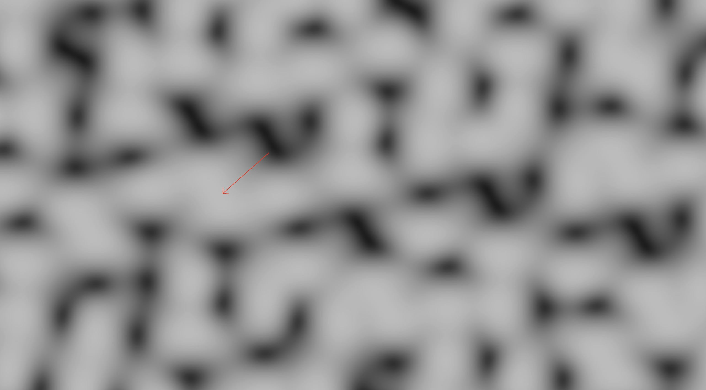
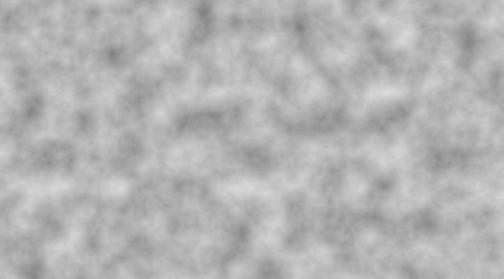

# Derivatives

Up until now, we've mostly been concerned with the output of a noise function.
But that's not always enough.
Sometime you also need to know how the noise function changes over some space.
How a noise function changes is called a derivative, or more rigorously, a gradient.
But since gradients can also refer to gradient noise, noiz calls them derivative in most places.

Not all noise functions have derivatives implemented, but those that do will have a `DIFFERENTIATE` constant, which is off by default.
For example: `MixCellGradients::<OrthoGrid, Smoothstep, QuickGradients, true>` is differentiated perlin noise.
These will produce [`WithGradient`](https://docs.rs/noiz/latest/noiz/cells/struct.WithGradient.html) values which contain derivative information.
These can also be collected from layered noise, ex: `Normed<WithGradient<f32, Vec2>>` (an `f32` value with its gradient as a `Vec2`).
Specifying a gradient type also limits what kinds of input types it supports since the gradient type must match the input type.

To visualize derivatives of noise, see the "show_gradients" example:

```text
cargo run --example show_gradients
```

For example, simplex noise produces these gradients:



See the red arrow?
That's the gradient of the noise at that point.
The gradient always points from low values to high values (here from black to white).

Knowing the derivative of a noise function can be very useful.
For example, if the noise is used as a hightmap to create landscapes, the derivative will tell you how a point on the landscape is sloping,
which can be used for erosion simulations, texturing, etc.
If the noise is being used for mesh generation, knowing the derivatives will allow constructing analytical normals, normals not generated strictly from geometry.

> Note:
All derivatives in noiz are computed analytically.
This does not use a [finite difference approximation](https://en.wikipedia.org/wiki/Finite_difference).
As a result, for non-differentiable functions (like absolute value), derivatives are not 100% correct everywhere.
Often the gradients are "good enough" to be useful, even if they are not mathematically rigorous.
Noise types do document the precision of their derivatives.
If you need perfect, "as perceived" derivatives, compute a finite difference approximation instead.
However, since that is rare (and very expensive) it is not supported directly by noiz.

## Erosion Approximation

As mentioned, derivatives can be used to simulate erosion.
But simulations are computationally expensive and require a finite landscape.
For most projects, that won't work, but noiz supports approximating erosion too.
This works by just changing `Normed` to `NormedByDerivative`.
Let's see an example:

```rust
use noiz::prelude::*;
use bevy_math::prelude::*;
let noise = Noise::from(LayeredNoise::new(
    NormedByDerivative::<
        // What we want to collect.
        // We could use `WithGradient<f32, Vec2>` here too to
        // collect the derivative of the eroded noise!
        f32,
        // We need a way to get the magnitude of a derivative gradient.
        // You almost always want EuclideanLength, but others are fun too!
        EuclideanLength,
        // This is the curve for the approximation.
        // This one is the cheapest and is used to make mountains.
        PeakDerivativeContribution,
        // Specifying the falloff changes how much
        // the erosion should actually affect things.
        // This is a fun value to play around with.
    >::default().with_falloff(0.3),
    Persistence(0.6),
    FractalLayers {
        layer: Octave(MixCellGradients::<
            OrthoGrid,
            Smoothstep,
            QuickGradients,
            // `NormedByDerivative` NEEDS gradient information.
            // It's a common mistake to forget to turn on the DIFFERENTIATE flag.
            true,
        >::default(
        )),
        lacunarity: 1.8,
        amount: 8,
    },
));
let value: f32 = noise.sample(Vec2::new(1.5, 2.0));
```

This produces the following: 

If you look closely, you'll notice more natural sloping here than on ordinary perlin noise.
This image is scaled up to make it easier to see, but it's best visualized with a rendered landscape.
To play around with that, run the "heightmap" example:

```text
cargo run --example heightmap
```

Note that this exact example is not the landscape that is displayed, but you can make you're own or copy the above noise function.

## Faking Derivatives

Sometimes a noise function doesn't support derivatives, but you still need it to produce them.
This may happen with `NormedByDerivative`, since it needs a derivative from each octave.
For those cases, noiz provides a [`WithGradientOf`](https://docs.rs/noiz/latest/noiz/misc_noise/struct.WithGradientOf.html) type, so you can fudge the numbers how you like.
Notably, worley noise does not support gradients, which is probably where this will be used the most.
